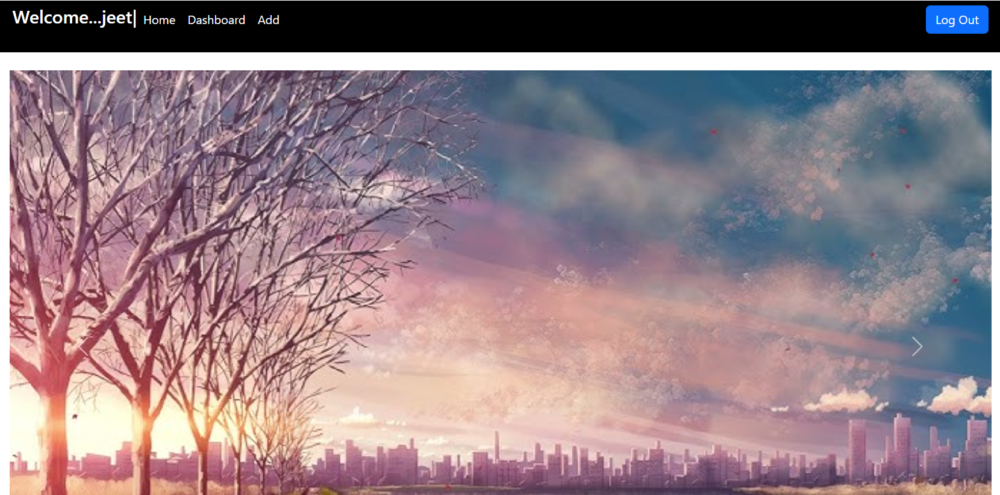
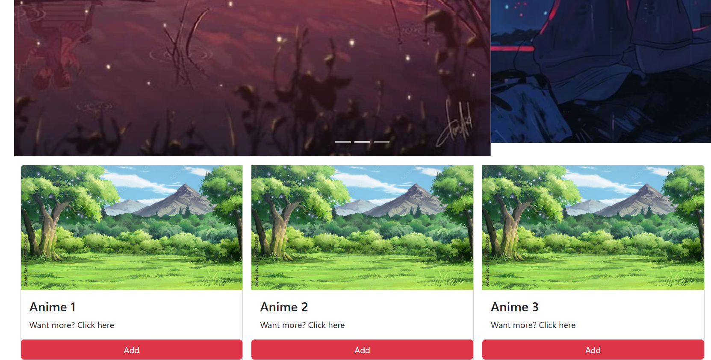
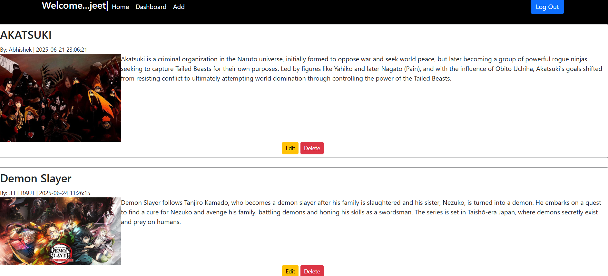
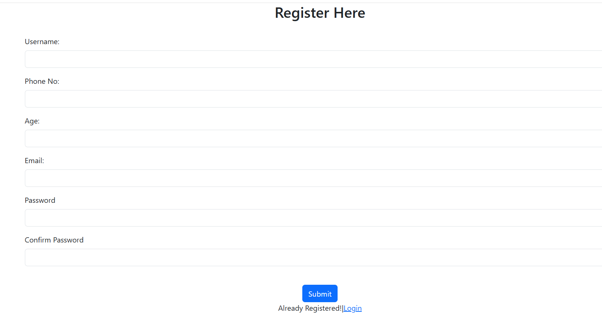
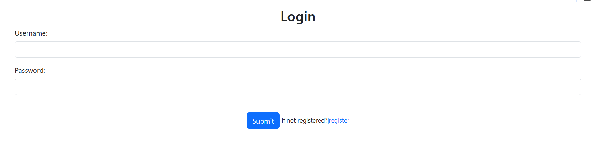

# 🎬AnimeHouse
A simple web application where users share their posts including Images and its content.Users with their registered account only are allowed as it is secured using basic session management for login.

# 🔑Key Features
- Session based User Registration & Login.
- Image upload.
- Create,edit & delete.
- DashBoard with all your posts.

# 🚀Technology
- HTML & CSS
- Bootstrap 5
- PHP
- MySQL Database

# 📸Screenshots
# Home
 
# DashBoard

# Register

# Login


```
npm install
npm start
```


[def]: image-1.png